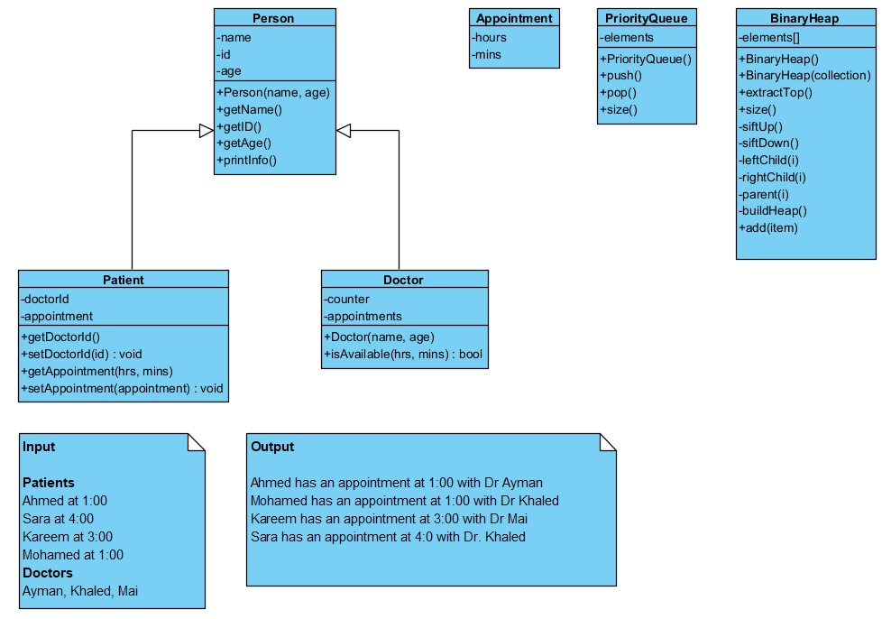

# Classes inheritance and overloading

## What is here?
This is an implementation of a simple generic priority queue data structure using various programming languages including: Python3, Javascript, C++, Java, and PHP

The classes contained are shown in the image above